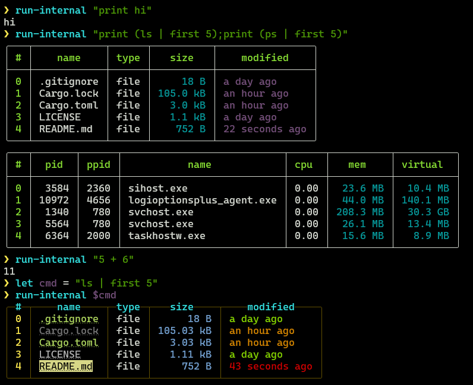
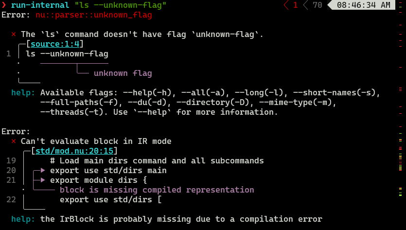

# nu_plugin_run_internal

This is a [Nushell](https://nushell.sh/) plugin called "run-internal". The idea is to be able to run internal nushell commands.

## Installing

```nushell
> cargo install --path .
```

## Usage

```
Runs internal command.

Usage:
  > run-internal <command>

Flags:
  -h, --help: Display the help message for this command

Parameters:
  command <string>: Internal command to run.

Input/output types:
  ╭─#─┬─input─┬─output─╮
  │ 0 │ any   │ any    │
  ╰───┴───────┴────────╯

Examples:
  Run an internal command
  > run-internal "ls"

  Run a pipeline
  > run-internal "print (ls | first 5);print (ps | first 5)
```

### Examples


### Error from bad command
